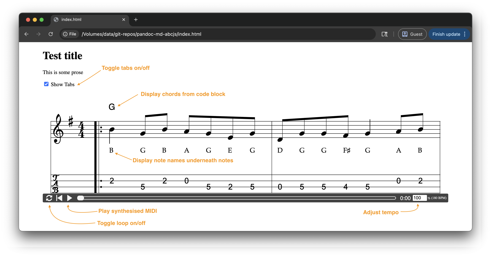

# pandoc-md-abcjs

## What is this?

A proof-of-concept repo for writing about music in Markdown codeblocks using abc notation:

<pre>
<code>
# Test title

This is some prose

````abcjs
X: 1
T: Test tune
M: 4/4
K: Gmaj
|:"G"B2GB AGEG|DGGF G2AB|
````
</pre>
</code>

Then render Markdown to HTML using pandoc:

```bash
pandoc index.md \
  -o index.html \
  --standalone \
  --from markdown \
  --to html5 \
  --template=template.html \
  --lua-filter=abcjs-passthrough.lua # Passthrough filter to prevent processing abcjs codeblocks
```

Resulting in:



## Who is this for?

Me (Nay)

## Why?

- I've been playing guitar for a long time and recently started on fiddle and tenor banjo
- I've been playing Irish folk music for a few years now
- I would like to dive a bit more deeply into tunes to think about the melodies and chord progressions
- I learn best when I can write prose around examples to build up to some conclusion (side effect of academia)
